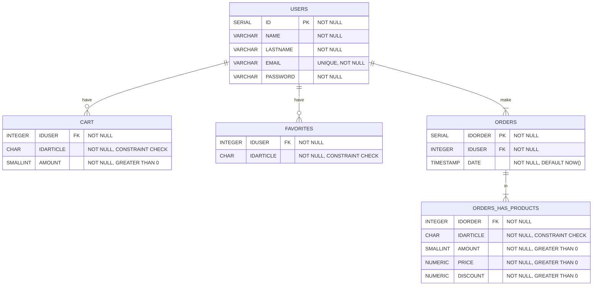

# Databases documentation

## Postgres (relational) database



## Mongo (non-relationsl) database: 


Here we store our products and it's images in two collections:

### Products collection: 

```json
{
  "serial": 1, 
  "name": "Aceite esencial de clavo", 
  "image": "/products/image/1",
  "units": "12ML",
  "price": 7.99, 
  "discount": 0, 
  "annotations": "665,83 €/L", 
  "description": "El aceite..."
}
```

### Images collection:

```json
  "serial": 1, 
  "image": "https://i.ibb.co/jGc94N2/1.jpg"
```
